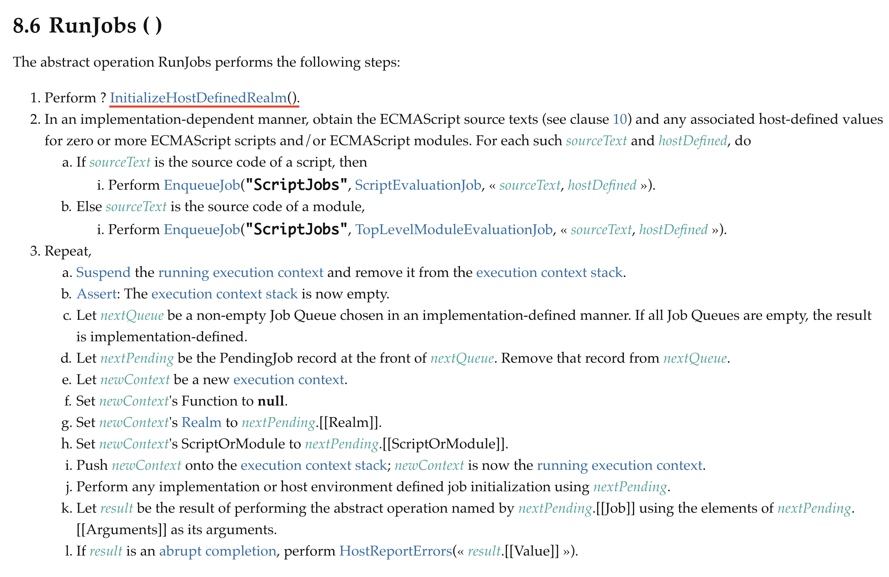

import styled from "styled-components";
import { Head, Image } from 'mdx-deck';
import { Twitter } from "styled-icons/fa-brands";
import { Blog } from "styled-icons/icomoon";
import nightOwl from "prism-react-renderer/themes/nightOwl";
import { Invert, Split, SplitRight } from 'mdx-deck/layouts';
export { default as theme } from './theme';
import { CodeSurfer } from "mdx-deck-code-surfer";
import getIcons from "./utils/getIcons.js";
import This from "./components/This";
import Logo from "./components/Logo";
import OutLink from "./components/OutLink";

export default SplitRight

<This />
---
# Hi
----
👋 I'm Karen

:computer: Frontend Engineer

:heart: Software Quality :heart: Helping Others

{React.createElement(getIcons(Blog, { title: "Personal Website" }))} <OutLink href="https://www.karenjs.com">karenjs.com</OutLink>
{" "}
{React.createElement(getIcons(Twitter, { title: "Twitter" }))} <OutLink href="https://twitter.com/kaafury">@kaafury</OutLink>

Feel free to stop by :point_up: and say :wave:
---
## Anatomy of the talk
---
- Place of `this` in runtime
- Reference Type
- Binding Types
- Strict Mode and This
- Exercises
---
## But first some prerequisite concepts that we will need

- Agents
- Realms
- JobQueue
- Execution Contexts
- Environments (records)
---
## Agents
---

---
## So?
---

---
Or in other words Agent is the current or any other isolated thread process
that encompasses the runtime and can communicate with other threads by means of
messages
---

---
So as we see our main runtime program and web worker are perfect examples
of agents, and here is a typical example how you might boostrap one
---
<CodeSurfer theme={nightOwl} code={require("!raw-loader!./snippets/worker.js")} />
---
## Realms
---
<Image size="contain" src="./images/Realm.png" />
---
### Iframe has its own Realm.

With its own custom global objects and constructors with distinct identities.

For example: `Array` constructors in top frame and in nested frame are different by identity,
so, for example, `instanceof` cross checks will fail.
---
## For example
---
<CodeSurfer theme={nightOwl} code={require("!raw-loader!./snippets/arrayIdentity.js")}/>
---
## JobQueues
---
<Image size="contain" src="./images/Jobs.png" />
---
The job queues are usually handled by the abstraction known as the “Event loop”.
ECMAScript standard doesn’t specify the event loop, leaving it up to implementations,
however you can find an educational example — [here](https://gist.github.com/DmitrySoshnikov/26e54990e7df8c3ae7e6e149c87883e4).
---
### Why is it important to us?
---
Jobs are enqueued on the job queues, and in current spec version there are two job queues: `ScriptJobs`, and `PromiseJobs`.
---
And initial job on the `ScriptJobs` queue is the main entry point to our program —
initial script which is loaded and evaluated: a Realm is created,
a global context is created and is associated with this Realm, it’s pushed onto the stack,
and the global code is executed as we will see in detail later
---
<CodeSurfer theme={nightOwl} code={require("!raw-loader!./snippets/job.js")} steps={[
    {range: [10, 12], notes: "This one schedules a PromiseJob"},
    {range: [10, 12], notes: "Which will happen after ScriptJobs"},
    {range: [19, 21], notes: "So this"},
    {range: [24, 26], notes: "Outputs this"},
]}/>
---
## Execution Contexts (stacks)
---
<Image size="contain" src="./images/ExecutionContexts.png" />
---

---

---
## Environments
---
<Image size="contain" src="./images/LexEnv.png" />
---
<CodeSurfer theme={nightOwl} code={require("!raw-loader!./snippets/lexicalEnv.js")}  steps={[
    {notes: "For example" },
    {range: [1, 15], notes: "This code"},
    {range: [15, 45], notes: "Creates this environment hierarchy"},
    {}
]} />
---
### And when looking at execution context and environment at the same time
---
<CodeSurfer theme={nightOwl} code={require("!raw-loader!./snippets/execution.js")} />
---
### This is what we see
---
<Image size="30%" src="./images/executionBlue.png" />
---
## Awesome we are set up to bootstrap our first example
---
## Let's start with a basic one
---
<CodeSurfer theme={nightOwl} code={require("!raw-loader!./snippets/console.log.js")} />
---
## Seems easy but what happens under the hood?
---
Agent starts with loading and executing the main global script
---

---
Then we

- Create new Realm object
- Create a new `GlobalObject` from Realm object's intrinsics
- Create a global execution context and make it current running
- Bind Realm with current execution context (Global Execution Context) through `RealmRecord` prop
- Create `[[GlobalEnvironment]]` with `[[GlobalThisValue]]` set to `GlobalObject`
- Populate Realm with `[[GlobalObject]]` and `[[GlobalEnvironment]]`
---

---

---

---
<CodeSurfer theme={nightOwl} code={require("!raw-loader!./snippets/bootstrapResults.js")} />
---
Now since our Realm is set up and we have `[[GlobalThisValue]]` set in Global Environment
we are ready to load our main initial `ScriptJob`
---
<Image src="./images/ScriptEvaluation.png" size="contain" />
---
Which essentially

- Parses our main script source code
- Suspends global execution context
- Pushes a new execution environment onto top of the global execution context
- Links Variable and Lexical environment of new context to Global Environment from Realm
- Populates new bindings in global environment record through Variable and Lexical environment
- Evaluates actual script body
- After finalizing pops the current execution context from stack out back to global execution context
---
<CodeSurfer theme={nightOwl} code={require("!raw-loader!./snippets/bootstrapResults2.js")} steps={[
    { notes: "Let's see"},
    { range: [1, 15], notes: "Before main script evaluation" },
    { range: [16, 37], notes: "When evaluating main script and populating bindings" },
    { range: [39, 55], notes: "After main script is over"}
  ]}/>
---
### Now let's check the actual function call part that just happened
---
<CodeSurfer theme={nightOwl} code={require("!raw-loader!./snippets/console.log.js")} steps={[
    { lines: [4], notes: "We start evaluating from right to left"},
    { tokens: {4: [4]}, notes: "Taking this keyword primary expression first" },
  ]}/>
---

---

---

---
And we remember that our lexical environment during execution of main execution context
was set to Global Environment, which means we return Global Environment
---

Which returns us `[[GlobalThisValue]]`, which is the `Realm[[GlobalObject]]` or just window in the main browser page.
---
console.log(this) // window

DONE :relieved:
---
Main lesson
---
- When evaluating `this` in global scope of main page, it's always going to be the Realm global object provided by the main page, aka `window`
- As a consequence, even strict mode has no effect on global `this` resolution from the global environment
---
<CodeSurfer theme={nightOwl} title="Global Use Strict Behavior " code={require("!raw-loader!./snippets/globalUseStrict.js")} />
---
Now really done with example 1
---
## Let's move to Example n.2
---
But before, let's review a specific concept that we will use in this one
---
## Reference Type
---

---
### Recap
---
ECMAScript defines Reference as a "resolved name binding".

It's an abstract entity that consists of three components — base, name, and strict flag.

The first 2 are what's important for us at the moment.
---
There are 2 cases when Reference is created: in the process of Identifier resolution and during property access.

In other words, foo creates a Reference and `foo.bar` (or `foo['bar']`) creates a Reference.

Neither literals — `1`, `"foo"`, `/x/`, `{ a: 1}`, `[ 1,2,3 ]`, etc., nor function expressions — `(function(){})` — create references.
---
### Let's elaborate more
---
<CodeSurfer theme={nightOwl} code={require("!raw-loader!./snippets/reference.js")} />
---

---
<CodeSurfer theme={nightOwl} title="CASE 1" code="foo" />
---
- gets evaluated as primary expression
- identifier is looked up in environment chain
- gets resolved with envRec base value and identifier name
---
<Image size="contain" src="./images/PrimaryExpression.png" />
---
<Image size="contain" src="./images/IdentifierEvaluation.png" />
---
<Image size="contain" src="./images/ResolveBinding.png" />
---
<Image size="contain" src="./images/GetIdentifierReference.png" />
---
Resulting reference:
---
<CodeSurfer theme={nightOwl} code={require("!raw-loader!./snippets/reference1.js")}/>
---
<CodeSurfer theme={nightOwl} title="CASE 2" code="foo.bar" />
---
- gets evaluated as a member expression
- the after dot identifier name is assigned the reference name
- the before dot identifier value gets assigned as a reference base
---
<Image size="contain" src="./images/MemberExpression.png" />
---
Resulting reference:
---
<CodeSurfer theme={nightOwl} code={require("!raw-loader!./snippets/reference2.js")}/>
---
<CodeSurfer theme={nightOwl} title="CASE 3" code="foo.bar.baz" />
---
- gets evaluated as a member expression
- the after dot identifier name is assigned the reference name
- the before dot member expression value gets assigned as a reference base
---
Resulting reference:
---
<CodeSurfer theme={nightOwl} code={require("!raw-loader!./snippets/reference3.js")}/>
---
## Going back to example
---
<CodeSurfer theme={nightOwl} code={require("!raw-loader!./snippets/console.log.advanced.js")} steps={[
    {},
    {range: [5,7], tokens: {10: [4, 5, 6, 7, 8]}, notes: "We are interested in these"},
    {range: [5,7], notes: "Let's start with method definition"}
]}/>
---
## Creating a prop method
---

---

---

---
### Let's recap

- create a new function object
- set outer `[[Environment]]` prop on the function object
- set hint `[[ThisMode]]` prop on function object
---
<Image size="contain" src="./images/ThisMode.png" />
---
## Now on to actual invocation
And since our `obj.method()` is a function call
Let's check callExpression evaluation in spec
---

---

---

---
### Important points

- We evaluate our member expression (object.method)
- We return reference out of it with base before dot and name after dot
- Based on that we define our actual this value before applying `[[thisMode]]` hints
---
Once more time the most important part
---

---
### Ok let's move on to actual call
---

---

---

---

---

---
### Recap

- we create a new execution context
- we create a new function environment
- we take previously provided `this` value and based on `[[ThisMode]]` hint decide whether:
---
- if `[[ThisMode]]` is set to `lexical`, (i.e. arrow function) skip binding `this`
- if `[[ThisMode]]` is set to `strict` bind the `this` with strict mode rules (see details later)
- if `[[ThisMode]]` is set to `global` bind the `this` with sloppy mode rules (see details later)
---
### That's it the `[[ThisValue]]` is bound

in our case it's bound to `object` in `object.method()`, which was to the left of dot.
---
Now we can call `this` expression and get it from recently bound `FunctionalEnvironmentRecord.[[thisValue]]`
---
Done !
---
## Binding types
---
- Default Binding
- With function `bind`
- With function `call`, `apply`
- With lexical binding (arrow function
- With `new` expression
---
### Default binding
---
<CodeSurfer theme={nightOwl} code={require("!raw-loader!./snippets/defaultBinding.js")} />
---
No tricks works as expected
---
### Bind function
---
`bind` creates a dummy function wrapper remembering the thisValue passed as the first param.

Which means calling it explicitly with `call`, `apply`, or applying another `bind` won't

change the already remembered (cached) `this` value
---
<Image size="contain" src="./images/BoundThis.png" />
---
<CodeSurfer theme={nightOwl} code={require("!raw-loader!./snippets/bind.js")} />
---
### `Call`, `Apply`

These allow call time binding of `this` value explicitly to whatever passed as first param
---
### Arrow function

As was discussed previously arrow function doesn't have a `this` value, and when called
uses the `this` value of previous execution context in call stack.
---
### For example
---
<CodeSurfer theme={nightOwl} code={require("!raw-loader!./snippets/arrowFunction.js")} />
---
### And finally
---
<Image size="contain" src="./images/thisStrict.png" />
---
# Exercises

[Link](https://gist.github.com/kapral18/8ddb6ac27c3b42a53c69c48b2b082fd3)
---
# Resources used

- [Spec](https://tc39.github.io/ecma262/)
- [YDKJS](https://github.com/getify/You-Dont-Know-JS/tree/master/this%20%26%20object%20prototypes)
- [Soshnikov Blog](http://dmitrysoshnikov.com/ecmascript)
- [Soshnikov Quiz](http://dmitrysoshnikov.com/ecmascript/the-quiz/)
- [Kangax Blog](http://perfectionkills.com/know-thy-reference/)
- [Kangax Quiz](http://perfectionkills.com/javascript-quiz-es6/)
- [EC](https://hackernoon.com/javascript-execution-context-and-lexical-environment-explained-528351703922)
---
# Thank you
